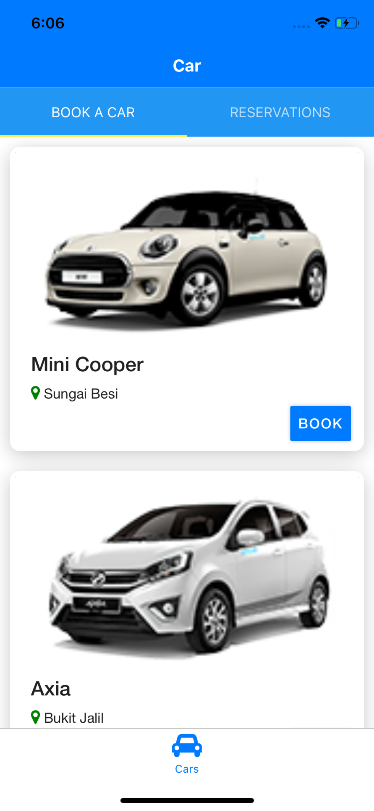
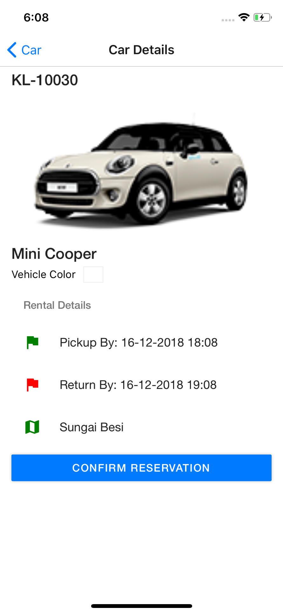
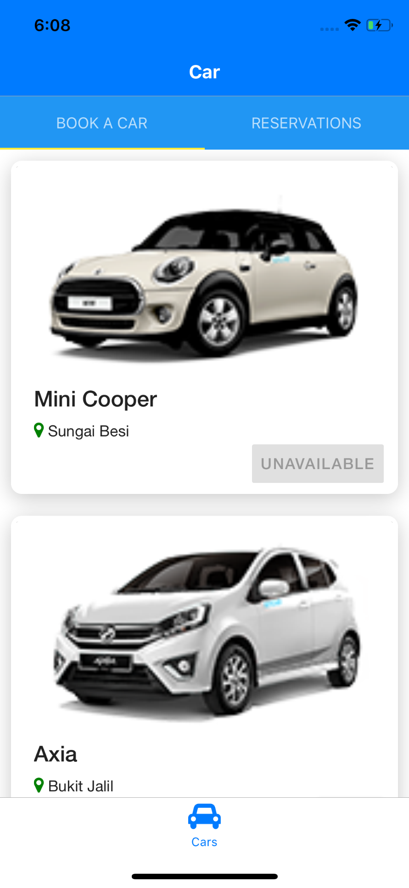
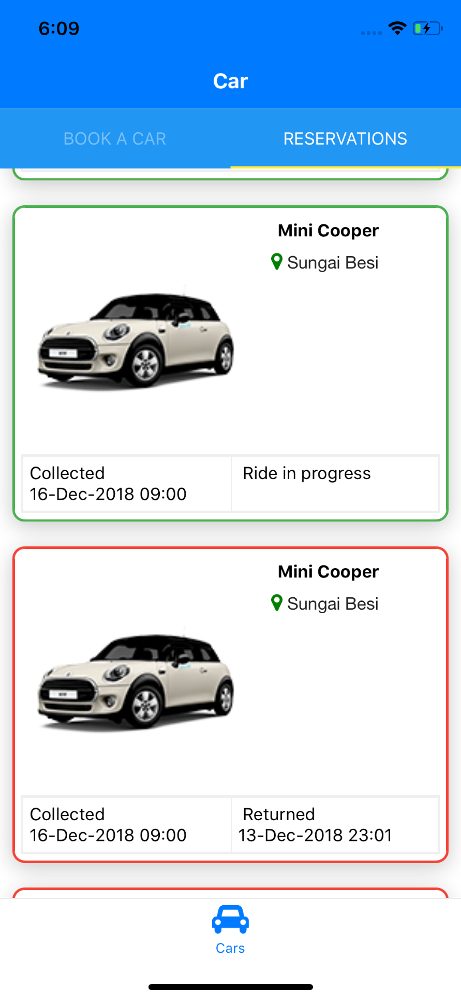

# Setup
Update for new enhancements 

Run,
    // add new packages
    $ npm install
    
Go to ios directory and run,

    $ cd ios 
    //delete pod folder and pod.lock file
    $ pod install && cd ..

start react-native

    $ react-native run-ios  --simulator="iPhone Xs"

# SocarProject

- Create Cars Tab

- Booking Screen

- Show Active and in-active Reservations List

- Used Redux for storing the states

Added Screenshots for reference 

 

 

**The reservations list is showing the wrong time for collection and returned due to the firestore timestamp, the server is synced to US.Sorry for that**